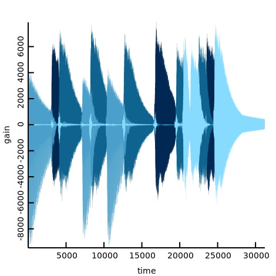
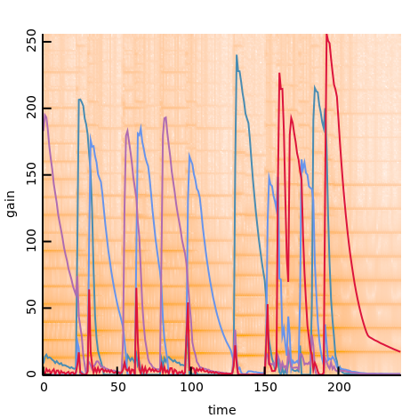

# Audio separation using STFT and non-negative matrix factorization

## usage

```console
$ dub run
```

Now, some png and wav are created. You can listen every four notes in test10k.wav are factorized into 0-3.wav.

## results

- mixed waveform


- factorized waveform



- mixed waveform in STFT domain


- factorized waveform and STFT



## See also

Julia reference implementation https://github.com/r9y9/julia-nmf-ss-toy
